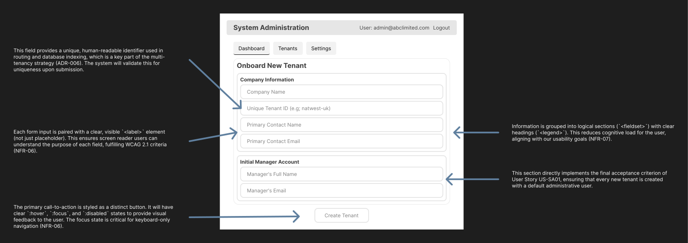
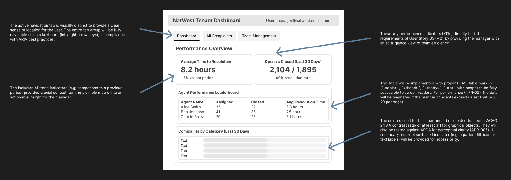
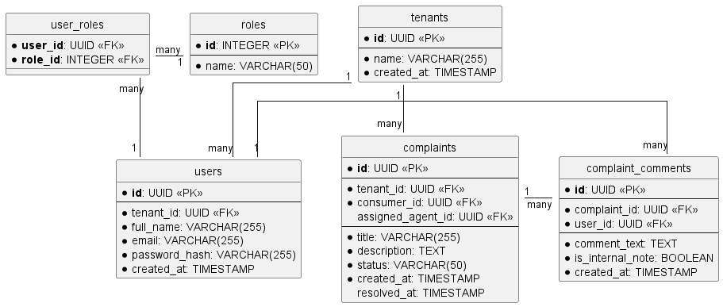

# Software Architecture Design Description (SADD)

## Complaint Management System (CMS)

**Author:** Tim Chinye
 
**Student ID:** c3032230
 
**Module:** 55-608809 - Software Architecture and Design
 
**Date:** 03/12/2025

---

### Document Control

| Version | Date       | Author     | Changes                                |
| :------ | :--------- | :--------- | :------------------------------------- |
| 0.1     | 03/12/2025 | Tim Chinye | Initial draft                          |
| 0.5     | 06/12/2025 | Tim Chinye | Completed all core architectural and design artifacts |
| 1.0     | 10/12/2025 | Tim Chinye | Final version for submission           |

---

### Table of Contents

1. Introduction
2. Solution Architecture
3. Solution Design
4. Appendix

---

## 1. Introduction

### 1.1 Purpose

This document outlines the software architecture and design for the Complaint Management System (CMS). It details the architectural goals, key design decisions, and technical specifications required to guide the development and implementation of the system, ensuring it meets all functional and non-functional requirements.

### 1.2 Scope

This SADD covers the architectural and design considerations for the CMS. This includes the system's structure, technology stack, data design, security model, and user interface concepts. It also serves as the formal record of design decisions and the response to formative feedback received during the design process.

### 1.3 Definitions, Acronyms, and Abbreviations

| Term | Definition                               |
| :--- | :--------------------------------------- |
| ADR  | Architecture Decision Record             |
| APCA | Accessible Perceptual Contrast Algorithm |
| CMS  | Complaint Management System              |
| ERD  | Entity-Relationship Diagram              |
| JWT  | JSON Web Token                           |
| NFR  | Non-Functional Requirement               |
| OIDC | OpenID Connect                           |
| PoC  | Proof of Concept                         |
| RBAC | Role-Based Access Control                |
| SADD | Software Architecture Design Description |
| SSO  | Single Sign-On                           |
| WCAG | Web Content Accessibility Guidelines     |

### 1.4 Response to Formative Feedback

This document has been refined based on formative feedback discussed with the module lecturer. The following table summarises the key points discussed and the actions taken, demonstrating an iterative approach to the design process.

| Feedback Point / Question Raised | Discussion and Action Taken | Relevant Section(s) |
| :------------------------------- | :-------------------------- | :------------------ |
| **Tooling:** Is Figma a suitable tool for creating wireframes, and can they be exported correctly? | **Action:** Confirmed that Figma is a suitable tool. Demonstrated that designs can be exported to a vector format (SVG) for high-quality inclusion in the SADD. The wireframes presented in this report were created and exported from Figma. | 3.1 |
| **Wireframe Fidelity:** Are the current wireframes too high-fidelity? | **Action:** The feedback confirmed that the wireframes are slightly high-fidelity but are acceptable as is. As per the advice "don't do anything more!", no further detail was added, and the wireframes were deemed sufficient for illustrating the UI/UX design concepts. | 3.1 |
| **Word Count:** Is the current word count of ~2,650 words acceptable against the 3,000-word maximum? | **Action:** Confirmed that the current word count is appropriate and that appendices do not contribute to the total count. The report remains within the specified limits. | All |
| **Proof of Concept Scope:** Is the planned PoC slice sufficient? | **Action:** The proposed scope for the Task 2 PoC - implementing system admin tenant onboarding and a subsequent tenant manager login - was validated as a sufficient and effective slice to prove the core multi-tenancy and security architecture. This feedback confirms the PoC plan is well-focused and appropriate. | N/A (Relates to Task 2) |
| **Academic Reference:** Recommendation to incorporate academic research for architectural decisions. | **Action:** The recommended publication (Justino et al., 2025) on microservice granularity was reviewed and integrated into the rationale for re-evaluating the architectural style. Concepts such as "granularity saturation" were used to add academic rigor to the decision to adopt a microservices architecture. | ADR-004 (Appendix C) |

---

## 2. Solution Architecture

### 2.1 Architectural Goals & Constraints

The architecture is driven by the primary goal of creating a secure, scalable, and reliable multi-tenant SaaS platform. The key architectural goals ("-ilities", as Martin Cooper says) are:

*   **Scalability:** To elastically handle a massive user base (NFR-01) without performance degradation.
*   **Security:** To guarantee strict, provable data isolation between tenants (NFR-03).
*   **Availability:** To provide a 24/7 service with high uptime and fault tolerance (NFR-05).
*   **Maintainability & Extensibility:** To allow the system to evolve and integrate new features (NFR-08, NFR-09) with independent development and deployment cycles.

The main constraint is the reliance on open-source technologies to manage costs while delivering an enterprise-grade, feature-rich solution.

### 2.2 Non-Functional Requirements (NFRs)

| ID     | Category            | Requirement Description | Justification |
| :----- | :------------------ | :---------------------- | :------------ |
| NFR-01 | **Scalability**     | The system must be architected to support a baseline of 20 million consumer users per tenant and accommodate a 10% year-on-year growth in user base. | Sourced directly from the case study's user base projection to ensure the system can handle the target market's load. |
| NFR-02 | **Performance**     | All API response times for interactive user queries must be below 200ms at the 95th percentile under projected load. | To provide a fluid and responsive user experience, preventing user frustration and abandonment of tasks. |
| NFR-03 | **Security**        | The system must enforce strict data isolation between tenants. This will be implemented via row-level security using a `tenant_id` column in all relevant database tables. | To prevent data breaches between client companies, as formally decided in ADR-006. |
| NFR-04 | **Security**        | User authentication must be secure, including storing passwords using a strong, salted hashing algorithm. | To protect user accounts from being compromised, even in the event of a database breach. We have chosen Argon2 for this purpose. |
| NFR-05 | **Availability**    | The core online services of the CMS must achieve 99.9% uptime (high availability), excluding planned, communicated maintenance windows. | As per the case study's "24/7 for online services" requirement, ensuring the system is reliably available for global users at all times. |
| NFR-06 | **Accessibility**   | All user-facing web interfaces must be compliant with Web Content Accessibility Guidelines (WCAG) 2.1 at Level AA. This will be the primary measure of compliance. | Explicitly required by the case study to ensure the system is usable by individuals with disabilities, meeting legal and ethical standards. |
| NFR-07 | **Usability**       | The system shall provide a consistent and intuitive user experience, minimizing the cognitive load and steps required to complete key tasks. | To enhance user satisfaction and efficiency, reducing the need for extensive user training for tenant employees. |
| NFR-08 | **Extensibility**   | The architecture must be modular and expose functionality through a versioned API to allow for future integration with chatbots and mobile apps. | Directly addresses the case study's future requirements, ensuring the system is future-proof and can evolve without a complete rewrite. |
| NFR-09 | **Maintainability** | The system will be decomposed into logically distinct modules/services to allow for independent development, testing, and deployment. | To support developer productivity, reduce the complexity of changes, and improve the long-term maintainability of the codebase. |

### 2.3 Technology Stack

The technology stack for the CMS is chosen to align with our microservices architecture (ADR-004) and to leverage modern, robust, and widely-supported open-source technologies.

| Layer    | Technology                     | Justification |
| :------- | :----------------------------- | :------------ |
| Frontend | React                          | A mature, component-based library ideal for building complex and interactive user interfaces like the dashboards and forms required by the CMS. Its vast ecosystem and the team's proficiency with it ensure rapid, high-quality development. |
| Backend  | Node.js (with Express)         | Chosen as the unified runtime for all backend microservices to ensure consistency and accelerate development. Its non-blocking, event-driven architecture is highly performant and well-suited for building scalable, I/O-bound API services. |
|          | -> Auth Service (Node.js)      | Will handle all authentication and authorisation logic. It will implement the stateless JWT pattern (ADR-008) and the OpenID Connect flows for SSO (ADR-009), using Passport.js for strategy management and Argon2 for best-in-class password hashing. |
|          | -> Users & Complaints Services | These services will contain the core business logic. Node.js allows for rapid development of the required RESTful APIs, we will use the standardized, native node-fetch library to provide a consistent, promise-based API for making HTTP requests. |
| Database | PostgreSQL                     | Selected as the primary relational database (ADR-007). Its robustness, support for transactional integrity (ACID), and powerful feature set are essential for reliably storing the highly relational data of the CMS. |

### 2.4 C4 Model - Level 1: System Context

The System Context diagram provides the highest-level, zoomed-out view of the CMS. It shows the human actors who interact with the system and the key external system dependencies, establishing the system's boundaries and scope without revealing internal technical details.

**Figure 1: C4 System Context Diagram for the CMS.**

### 2.5 C4 Model - Level 2: Container

The Container diagram zooms into the CMS to show the high-level technical building blocks. Each container represents a separately deployable unit, such as a backend service or a frontend application. This diagram visually represents the Microservices Architecture (ADR-004), consisting of a React Frontend, several Node.js backend services, and a central PostgreSQL database.

**Figure 2: C4 Container Diagram for the CMS.**

---

## 3. Solution Design

### 3.1 User Interface & Experience (UI/UX) Design

The following mid-fidelity wireframes were created in Figma to illustrate the layout and user flow for key screens. They are annotated to connect specific design choices with the project's non-functional requirements, particularly usability (NFR-07) and accessibility (NFR-06).

**Figure 3: Wireframe for the "Onboard New Tenant" Screen (System Admin).**

**Figure 4: Wireframe for the "Performance Dashboard" Screen (Manager).**

*An interactive version of both wireframes is available on [Figma](https://www.figma.com/design/5mRbS4AzqyJVuZDmL1LDae).*

#### 3.1.1 Accessibility Considerations

As defined in NFR-06, the primary goal for accessibility is strict compliance with the 'Web Content Accessibility Guidelines (WCAG) 2.1 at Level AA'. All design choices, from color selection to interactive elements, will be validated against this standard. This includes ensuring a minimum contrast ratio of 4.5:1 for normal text, providing text alternatives for non-text content, and ensuring all functionality is operable via a keyboard.

However, it is a known issue within the web development community that the WCAG 2.x contrast algorithm can produce results that are not perceptually uniform. To build a product that is not only compliant but also genuinely usable and future-proof, our design process will also reference the 'Accessible Perceptual Contrast Algorithm (APCA)'. APCA is the candidate contrast method for the upcoming WCAG 3.0 standard and provides a more scientifically accurate model of human visual perception.

**Our design strategy is therefore twofold:**
1.  **Primary Compliance:** The color palette and typography choices must pass WCAG 2.1 AA requirements. This is the non-negotiable baseline.
2.  **Enhanced Usability:** Wherever possible, the chosen color combinations will also be tested against APCA to ensure they meet modern standards for readability, aiming for a minimum Lc value of 75 for body text.

This dual approach ensures the system meets its immediate contractual obligations while striving for the highest level of practical accessibility for its users.

### 3.2 C4 Model - Level 3: Component

This Component diagram zooms into the "Users Service" container to show its internal components. It illustrates a clean, layered architecture, separating API concerns (Controller), business logic (Service), and data access (Repository) to improve maintainability (NFR-09).

**Figure 5: C4 Component Diagram for the Users Service.**

### 3.3 C4 Model - Level 4: Code

To provide the deepest level of detail, this class diagram zooms into the "User Service" component. It shows the key classes and interfaces for the implementation, demonstrating the application of the Dependency Inversion Principle. The high-level `UserService` class depends on an `IUserRepository` interface, not a concrete `PostgresUserRepository` implementation, which allows for easier testing and future flexibility.

**Figure 6: C4 Class Diagram for the User Service Component.**

### 3.4 Data Design

The data model is the blueprint for the system's persistence layer. The Entity-Relationship Diagram (ERD) below is designed for our chosen PostgreSQL database (ADR-007) and is foundational to our multi-tenancy strategy (ADR-006). The presence of a non-nullable `tenant_id` foreign key on critical tables like `users` and `complaints` is the cornerstone of our data isolation approach (NFR-03).

**Figure 7: Data Model (ERD) for the CMS.**

### 3.5 Security Design

Security is a foundational pillar of the CMS, addressing the critical requirements of a multi-tenant, enterprise-grade platform. Our approach is multi-layered, encompassing authentication, authorisation, and data isolation.

#### 3.5.1 Authentication

Authentication is the process of verifying a user's identity. Our system employs a sophisticated and flexible authentication strategy, as detailed in our ADRs.

*   **Primary Mechanism (Stateless JWTs):** As decided in ADR-008, the system will use stateless JSON Web Tokens (JWTs) for all API authentication. After a user successfully logs in, the Authentication Service issues a short-lived, cryptographically signed JWT. This token is then passed in the `Authorisation` header for all subsequent requests to any microservice. Each service can independently and performantly verify the token's signature without needing to contact a central session store, which is ideal for our scalable, distributed architecture.

*   **Federated Identity (SSO):** To meet the security and usability expectations of our enterprise tenants, we will support federated identity via the OpenID Connect (OIDC) protocol, as outlined in ADR-009. This allows tenant employees to authenticate using their existing corporate credentials (e.g; Microsoft 365, Google Workspace). This not only provides a seamless Single Sign-On (SSO) experience but also delegates complex security policies, such as Multi-Factor Authentication (MFA), to the tenant's trusted Identity Provider.

*   **Password Security:** For users authenticating directly with the CMS, password security is paramount (NFR-04). Passwords will never be stored in plain text. Instead, we will store a salted, one-way hash of the password. For this critical function, we have selected Argon2, the winner of the 2015 Password Hashing Competition and the current industry recommendation. While the more traditional bcrypt is still considered secure, Argon2 was chosen for its superior resistance to modern hardware-based (GPU/ASIC) cracking attempts, ensuring the highest level of security for user credentials. The secure password reset mechanism is detailed in ADR-003.

#### 3.5.2 Authorisation (RBAC)

Authorisation is the process of determining what an authenticated user is allowed to do. We will implement a Role-Based Access Control (RBAC) model to enforce the principle of least privilege.

*   **Role Definitions:** Users will be assigned one of the primary roles defined in the system. Each role has a specific set of permissions that dictate its capabilities. These roles and permissions are embedded within the user's JWT upon login, allowing for stateless authorisation checks at the API gateway or within each individual microservice.

*   **Tenant Data Segregation:** The most critical authorisation rule is the enforcement of multi-tenancy, as decided in ADR-006. The `tenant_id` is a primary claim within every user's JWT. Every API request and database query that accesses tenant-specific data must be filtered by the `tenant_id` from the token. This ensures that a user, regardless of their role, can never see or modify data belonging to another tenant.

The initial set of roles and their high-level permissions are defined as follows:

| Role             | Key Permissions |
| :--------------- | :-------------- |
| **Consumer**     | Create Complaint, View Own Complaints, Add Comment to Own Complaint. |
| **Agent**        | View Assigned Complaints, Update Complaint Status, Add Internal Notes, Create Complaint for Consumer. |
| **Manager**      | View All Complaints (for their tenant), Assign Complaints, View Dashboards, Manage Agent/Support users. |
| **System Admin** | Onboard New Tenants, Create Manager Users for Tenants, Manage platform-wide settings. |

**3.5.3 Tenant-Configurable Security Policies**

To meet the diverse security needs of our enterprise tenants, the system will be designed to support tenant-level security configurations. A System Administrator or a tenant's Help Desk Manager will be able to configure policies such as:

*   **Identity Provider:** Choose between using the local CMS user directory or configuring a federated identity provider (as per ADR-009) for their employees.
*   **Password Policy:** For tenants using local authentication, they can configure password complexity rules (minimum length, character requirements).
*   **MFA Mandate:** The ability to mandate that all their employee users must set up Multi-Factor Authentication to access the CMS.

Furthermore, the architecture is designed to accommodate tenants with complex identity needs, such as those resulting from mergers or with decentralized IT. The system will support configuring multiple federated identity providers per tenant, mapped by email domain. With various of Vodafone-level large companies as tenants, this is quite a likely situation. For example, a single tenant could be configured to route users with `@companya.com` emails to a Microsoft login, while routing users with `@partner-corp.com` emails to a Google login. This flexibility is achieved by storing IdP configurations in a dedicated table linked to each tenant, and is handled seamlessly by the two-step login flow, which directs the user to the appropriate provider after they enter their email address.

---

## 4. Appendix

### Appendix A: Refined User Stories

This appendix contains the detailed functional requirements for the CMS, written as user stories. Each story follows the Connextra template (`As a.. I want.. so that...`) and is accompanied by specific, testable Acceptance Criteria written in Gherkin syntax (`Given-When-Then`). This document serves as the primary source for guiding the detailed design and implementation.

*(Refer to the separate [./requirements/user_stories.md](./requirements/user_stories.md) file for the full content).*

### Appendix B: Identified Use Cases

This appendix provides a high-level, goal-oriented overview of the system's core functionality. It includes a Use Case Diagram to visualise the interactions between actors and the system, and a table describing each primary use case. This document serves as a strategic summary, with the granular details for each use case being elaborated upon in the User Stories (Appendix A).

*(Refer to the separate [./requirements/use_cases.md](./requirements/use_cases.md) file for the full content).*

### Appendix C: Architecture Decision Records Log

| ID | Title | Status | Date |
| :------ | :------------------------------- | :--------- | :--------- |
| ADR-001 | ADR Template Choice              | Accepted   | 03/12/2025 |
| ADR-002 | Architectural Style              | Superseded | 03/12/2025 |
| ADR-003 | Password Reset Mechanism         | Accepted   | 05/12/2025 |
| ADR-004 | Re-evaluated Architectural Style | Accepted   | 05/12/2025 |
| ADR-005 | Accessibility Strategy           | Accepted   | 05/12/2025 |
| ADR-006 | Multi-tenancy Strategy           | Accepted   | 05/12/2025 |
| ADR-007 | Database Choice                  | Accepted   | 06/12/2025 |
| ADR-008 | Authentication Mechanism         | Accepted   | 06/12/2025 |
| ADR-009 | Use Federated Identity & SSO     | Accepted   | 06/12/2025 |

### Appendix D: AI Transparency Statement

## AI Transparency Statement

**AITS Descriptor:** AITS 3: AI for Developing

For this assessment, I have used Artificial Intelligence (AI) in accordance with AITS 3 (AI for Developing) of the Artificial Intelligence Transparency Scale. This statement is an expansion of [the university's exemplar](https://www.shu.ac.uk/myhallam/study/assessment/artificial-intelligence-and-assessment#:~:text=an%20example%20student%20statement), adapted for a software architecture and design context rather than a traditional essay, whilst staying in accordance with the guidance provided in the assessment brief.

Specifically, I used Google's Gemini (via [AI Studio](https://aistudio.google.com/)) at different AITS levels for Task 1 and 2:

1. **AITS 2 (Shaping) for Task 1:** For the initial design phase, AI was used to help brainstorm potential Non-Functional Requirements derived from the case study and to refine the phrasing and acceptance criteria for the initial user stories. This helped to shape the problem domain and structure the planning artifacts.

2. **AITS 3 (Developing) for Task 2:** For the implementation of the Proof of Concept (PoC), I directed AI to generate boilerplate and skeleton code for specific components based on my pre-defined architecture and design. For example:
--- Start: To be updated, for accuracy.
   * After I designed the API contract for the Complaint Service, I used AI to generate the initial Flask/FastAPI controller class with empty function signatures for the required HTTP methods (e.g; `POST`, `GET`).  
   * I generated standard configuration files, such as a basic `Dockerfile` or a `requirements.txt` file, which I then reviewed and modified.  
   * I used it to create basic, non-complex React components based on my wireframes, which I then connected and imbued with state management logic.
--- End: To be updated, for accuracy.

My own human contribution was central to all of the project's core decisions and technical implementation. **AI-generated suggestions were treated as a starting point for my own investigation and were never directly implemented without critical evaluation and adaptation.** My contributions include:

* All high-level architectural decisions, including the selection of the microservices style, the multi-tenancy data isolation strategy, and the technology stack. These decisions are documented in my Architecture Decision Records (ADRs).  
* The creation of all design artefacts, including all C4 model diagrams (Context, Container, Component, Code), the data model (ERD), and wireframes.  
* The writing of all complex and core business logic within the PoC. AI-generated skeletons were filled in entirely by me.  
* The critical review, refactoring, security-hardening, and integration of all AI-generated code. I was solely responsible for ensuring the code was correct, secure, and fit for purpose within my architecture.

In this project, I acted as the architect and lead developer, using AI as a productivity tool to accelerate the development of standard or repetitive code segments. I directed the AI's output, critically evaluated every suggestion, and retained full ownership and responsibility for the final architecture, design, and quality of the submitted work.