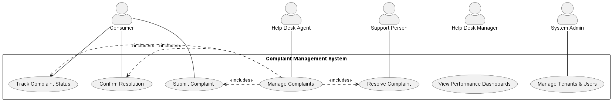

# Identified Use Cases for the Complaint Management System

This document identifies the primary use cases for the CMS, providing a high-level, goal-oriented overview of the system's functionality. Each use case represents a significant interaction that an actor can have with the system to achieve a specific objective.

The detailed step-by-step requirements, flows, and acceptance criteria for these use cases are elaborated upon in the [./user_stories.md](./user_stories.md) document.

### Use Case Diagram

The following diagram illustrates the main actors and the primary use cases they interact with.

### Use Case Descriptions

| Use Case ID | Use Case Name               | Actor(s)                  | Corresponding User Stories | Description |
| :---------- | :-------------------------- | :------------------------ | :------------------------- | :---------- |
| UC-01       | Submit Complaint            | Consumer, Help Desk Agent | US-C01, US-A01             | The process of creating and formally logging a new complaint into the system. |
| UC-02       | Track Complaint Status      | Consumer, Help Desk Agent | US-C02, US-A03             | The ability for a user to view the current status and history of a previously submitted complaint. |
| UC-03       | Resolve Complaint           | Support Person            | US-S02                     | The process by which a specialist investigates a complaint, applies a fix, and updates the system. |
| UC-04       | Confirm Resolution          | Consumer                  | US-C03                     | The final step where the consumer confirms their satisfaction with the resolution, allowing the complaint to be closed. |
| UC-05       | Manage Complaints           | Help Desk Agent           | US-A02                     | The general process of overseeing a complaint's lifecycle, including assigning it to a specialist. |
| UC-06       | View Performance Dashboards | Help Desk Manager         | US-M01                     | The ability to view aggregated data, reports, and KPIs regarding team and system performance. |
| UC-07       | Manage Tenants & Users      | System Admin              | US-SA01, US-SA02           | The administrative functions of onboarding new tenant companies and managing their top-level user accounts. |